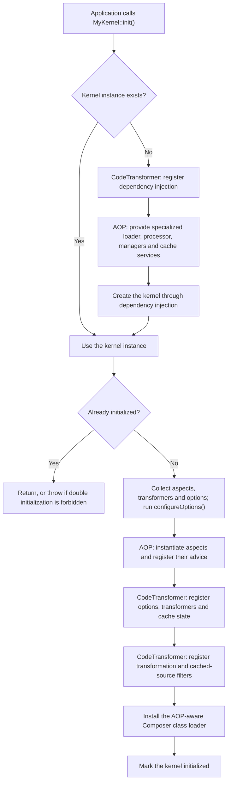
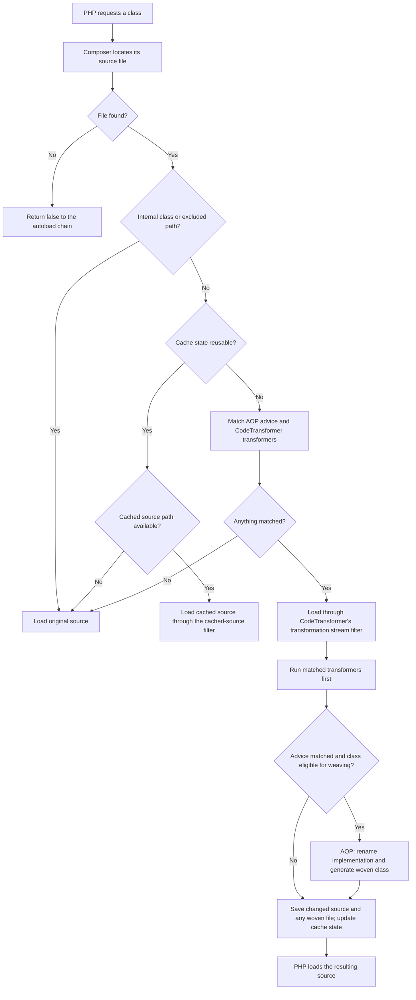
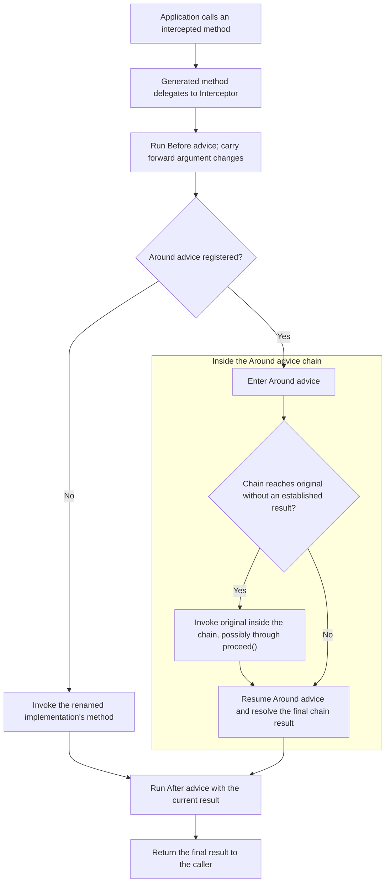

# How PHP-AOP works

PHP-AOP extends CodeTransformer's class-loading and source-transformation pipeline.
CodeTransformer supplies the kernel lifecycle, dependency injection, transformer
management, stream filters, and cache infrastructure. PHP-AOP adds aspect matching,
class weaving, and advice execution.

These diagrams describe the current implementation. They use Mermaid, which GitHub
renders directly inside Markdown. This page separates initialization, class loading,
and method execution because they happen at different times.

## 1. Initialize the kernel

Call your kernel's `init()` before loading the classes you want to intercept.



The specialization uses service decoration: AOP's class loader extends
CodeTransformer's loader, and `AspectProcessor` extends `TransformerProcessor`.
The aspect and transformer managers can use the application's custom dependency
injection callback to construct components.

Implementation: [AopKernel](../src/AopKernel.php), plus the inherited
`CodeTransformerKernel` lifecycle from the `okapi/code-transformer` dependency.

## 2. Load a class

The AOP loader first asks Composer for the source file. Internal framework classes
and excluded paths bypass matching and transformation.



Cache reuse depends on the configured mode:

| Mode | Behavior |
| --- | --- |
| Debug enabled | Bypass cache reuse and match again. |
| Development | Reuse existing cache state only when `isFresh()` succeeds. |
| Production | Trust existing cache state without checking source freshness. |

For a reusable state, the loader either returns the original source path or loads
the recorded cache path through a stream filter. When rebuilding, processing can
record woven, transformed-only, or no-transformation cache state. A class with no
matching advice or transformers returns its original path immediately.

When a class is woven, the generated relationship is:

```php
// Renamed implementation, retaining its original parent if it had one:
class MyClass__AopProxied extends OriginalParent { /* Original implementation */ }

// Generated class under the name application code already uses:
class MyClass extends MyClass__AopProxied { /* Intercepted method wrappers */ }
```

For a class without an original parent, the first declaration has no `extends`
clause. The woven class extends the renamed implementation. Application code keeps
using `MyClass`; it does not switch to a separate wrapper object. Source rewriting
and the stream filters preserve source-file locations for debugging.

Implementation: [ClassLoader](../src/Core/AutoloadInterceptor/ClassLoader.php),
[AspectProcessor](../src/Core/Processor/AspectProcessor.php),
[ProxiedClassModifier](../src/Core/Transform/ProxiedClassModifier.php), and
[WovenClassBuilder](../src/Core/Transform/WovenClassBuilder.php).

## 3. Invoke an intercepted method

Class loading prepares the wrappers. Each subsequent call to an intercepted method
uses the registered advice; it does not repeat source matching and weaving.



This is the normal successful path. An exception interrupts it; `After` is not a
`finally` handler. Missing advice groups are skipped. The configured advice order
is applied within the Before, Around, and After groups.

An Around invocation's `proceed()` advances the chain. The original method can run
inside that call; the Around advice then resumes and can modify the result. The
chain also continues
after an advice returns; merely omitting `proceed()` is not sufficient to suppress
the original call. Supplying a result can avoid the original call. The chain
normally reuses an established result; `proceed(true)` permits repeated original
calls, including from After advice. An explicit `setResult(null)` distinguishes a
replacement null result from an advice that returns no replacement value.

Implementation: [Interceptor](../src/Core/Intercept/Interceptor.php),
[AdviceChain](../src/Core/Invocation/AdviceChain.php), and
[MethodInvocation](../src/Invocation/MethodInvocation.php).
